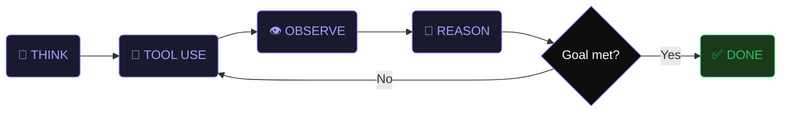

<div align="center">
  
</div>

<div align="center">
  
</div>

<br/>

<div align="center">

```
╔══════════════════════════════════════════════════════════════╗
║                                                              ║
║   "I've been in places where technology meant survival.      ║
║    That shapes how I build — with intention, with            ║
║    precision, and with zero tolerance for things             ║
║    that don't work."                                         ║
║                                                 — Wilkin S.  ║
║                                                              ║
╚══════════════════════════════════════════════════════════════╝
```

</div>

<br/>

<div align="center">
  
  
  
  
</div>

<br/>

---

## ⚡ The Agentic Loop

> This is how I think about building with AI — not autocomplete, but autonomous systems that think, act, observe, and improve.



---

## 🚀 Currently Shipping

<div align="center">
  <table border="0" cellspacing="10" cellpadding="8">
    <tr>
      <td align="center">
        <a href="https://tend.host">
          <br/>
          <sub>AI agents handle your ops layer</sub>
        </a>
      </td>
      <td align="center">
        <a href="https://radiodune.com">
          <br/>
          <sub>Make Radio Cool Again</sub>
        </a>
      </td>
      <td align="center">
        <a href="https://vocastory.com">
          <br/>
          <sub>20+ TTS engines · voice cloning</sub>
        </a>
      </td>
    </tr>
    <tr>
      <td align="center">
        <a href="https://theradioguide.com">
          <br/>
          <sub>24hr grid · 14 languages</sub>
        </a>
      </td>
      <td align="center">
        <a href="https://ondacast.com">
          <br/>
          <sub>Web & Smart TV podcast directory</sub>
        </a>
      </td>
      <td align="center">
        <br/>
        <sub>In active development 🔧</sub>
      </td>
    </tr>
  </table>
</div>

---

## 🛠️ Stack

<div align="center">
  
  <br/><br/>
  
  <br/><br/>
  
</div>

<br/>

<div align="center">
  
  
  
  
  
  
</div>

---

## 📊 Stats

<div align="center">
  
</div>

<div align="center">
  
  
  
</div>

---

## 📡 Connect

<div align="center">
  <a href="https://wilkinsantana.com">
    
  </a>
  &nbsp;
  <a href="https://www.linkedin.com/in/wilkin-santana/">
    
  </a>
  &nbsp;
  <a href="https://x.com/rubiteve">
    
  </a>
  &nbsp;
  <a href="mailto:hello@wilkinsantana.com">
    
  </a>
</div>

<br/>

<div align="center">
  
</div>
